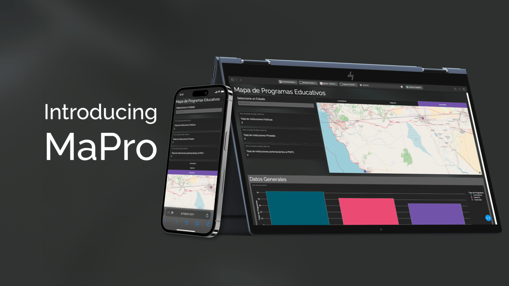

# MaPro
MaPro, para el público general es un sitio web, una interfaz a la cual tienen acceso desde su navegador, en la que al acceder a este sitio lo que tendrán será un dashboard que tiene como objetivo principal servir de herramienta para aquellos estudiantes que están por pasar a su siguiente grado, ya sea licenciatura, maestría o doctorado y tengan la capacidad de ver en un mapa la ubicación y demás características de las instituciones disponibles en el área de ciencias de la computación.
## Demo

<!--salto de página -->

<!-- otro salto de página -->

<!-- Otra imagen con tamaño ajustado -->

<!-- otro salto de página -->

<!-- Otra imagen con tamaño ajustado -->

